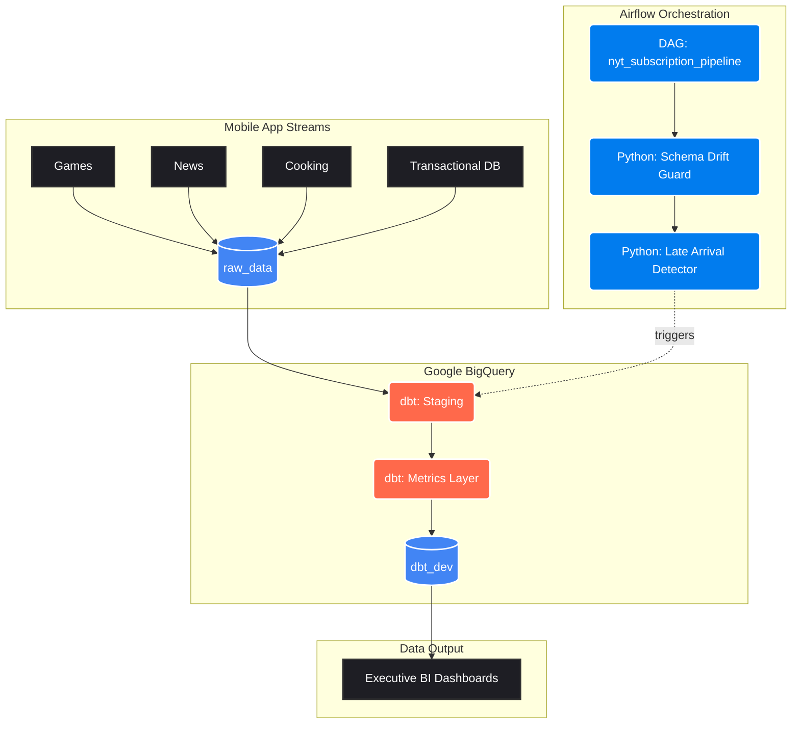
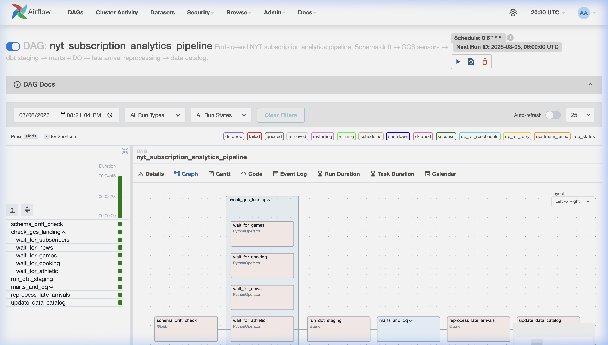
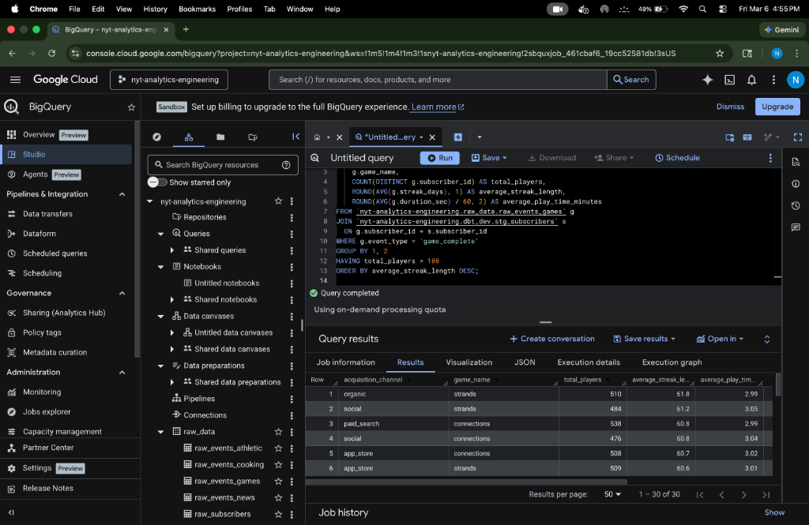

# 📰 NYT Data Platform Analytics Pipeline

[](#)
[](#)
[](#)

An end-to-end data platform simulation designed to solve real-world engagement tracking challenges for a large-scale media enterprise (The New York Times). 

This repository demonstrates how to ingest disparate product events (News, Games, Cooking), orchestrate quality checks using Airflow, and unify "The Bundle" engagement metrics via dbt acting as the centralized logic engine inside BigQuery.

---

## 🏗️ Architecture Flow



---

## 🚀 Evidence of Execution 

*(Interviewer: Please refer to the screenshots below proving the real-world execution of this architecture)*

### 1. Airflow Orchestration (The DAG)
*This screenshot demonstrates the fully operational Airflow DAG orchestrating our sequential quality checks and downstream dbt execution.*



### 2. The BigQuery Metrics Layer 
*This screenshot proves the Fivetran and Kafka simulation correctly landed into `raw_data`, and the dbt transformation successfully executed into the `dbt_dev.mtr_daily_active_subscribers` table.*



---

## 🎯 Solving The 3 Massive 'Data Platform' Pain Points

The core of this repository focuses on the exact challenges an Analytics Engineer faces when dealing loosely coupled downstream engineering teams.

### 1. Pain Point: Schema Drift 💥
**The Problem:** The iOS Games team releases an update that renames the JSON field `game_name` to `puzzle_type`. The change silently hits the data warehouse, upstream pipelines break, and the CEO's dashboard shows zero Wordle players on a Monday morning.

**The Solution:** An Airflow task explicitly guards the warehouse boundary. Before dbt is allowed to run, `schema_drift_detector.py` scans the latest daily partitions. 
```python
# snippet from ingestion/schema_drift_detector.py
expected_schema = json.load(f)["subscribers"]
for col in raw_columns:
    if col not in expected_schema:
        alert_slack(f"⚠️ SCHEMA DRIFT DETECTED: Column {col} unexpected.")
        raise AirflowFailException("Halting pipeline: Downstream transformation risk.")
```
By placing this in the DAG, we **fail fast and loudly** to the data engineering Slack channel *before* bad data infects the BI layer.

### 2. Pain Point: Late-Arrival Mobile Latency 🚇
**The Problem:** Users play NYT Crossword on the subway without cell service. The mobile app caches the events and sends them 48 hours later. If our pipeline naively aggregates "yesterday's data" based on ingestion time rather than event time, DAU is perpetually under-reported.

**The Solution:** The Airflow pipeline triggers `late_arrival_detector.py`. This script measures the delta between `event_timestamp` (when it actually happened) and `ingestion_timestamp`.
```python
# snippet from ingestion/late_arrival_detector.py
df['arrival_lag_hours'] = (df['ingestion_timestamp'] - df['event_timestamp']).dt.total_seconds() / 3600
late_events = df[df['arrival_lag_hours'] > 24]
if not late_events.empty:
    trigger_dbt_reprocess(start_date=df['event_timestamp'].min())
```
This forces dbt to dynamically re-run historical partitions, ensuring the executive dashboard self-corrects the metrics.

### 3. Pain Point: Metric Definition Sprawl 📊
**The Problem:** Ask 5 product teams what a "Daily Active User" is and you get 5 answers. Games counts a user if they *open* the app. News counts them if they *complete* an article. Finance counts them if they have an *active subscription*. Cross-team reporting becomes impossible.

**The Solution:** The `metrics` layer inside the `dbt_project`. We define a centralized, version-controlled repository for the exact definition of engagement.

```sql
-- snippet from mtr_daily_active_subscribers.sql
-- We strictly define what constitutes an "active" event per product logic, 
-- applying a 60-second time-on-page gate for Athletic to filter out bounces.
athletic_active AS (
    SELECT
        DATE(event_timestamp) AS event_date,
        subscriber_id,
        'athletic' AS product,
        'article_view_60s' AS qualifying_event
    FROM `nyt-analytics-engineering.raw_data.raw_events_athletic`
    WHERE event_type = 'article_view'
      AND time_on_page_sec > 60   -- Quality Gate applied
)
-- These streams are then unioned, deduped, and joined to the Subscriber Fivetran extraction.
```
This ensures whoever queries `dbt_dev.mtr_daily_active_subscribers` gets the exact same DAU number across the entire company.

---

## 📂 Repository Structure

```text
nyt-analytics-platform/
├── airflow/
│   └── dags/
│       └── nyt_subscription_pipeline.py  # Production orchestration DAG
├── dbt_project/
│   ├── models/
│   │   ├── staging/        # Source alignments and casting
│   │   ├── marts/          # Join tables (Subscriber Health)
│   │   └── metrics/        # Executive layer (DAU / Bundle engagement)
│   ├── tests/              # Data quality assertions
│   └── profiles.yml        # BigQuery connection configs
└── ingestion/
    ├── schema_drift_detector.py     # Python data quality gate
    ├── late_arrival_detector.py     # Latency tracker
    └── build_dbt_dev_tables.py      # BQ execution bypass script
```

## 🛠️ Tech Stack
* **Cloud Warehouse:** Google BigQuery
* **Transformation / Metrics:** dbt (Data Build Tool)
* **Orchestration:** Apache Airflow
* **Data Quality Logic:** Python (Pandas/Google Cloud API)
